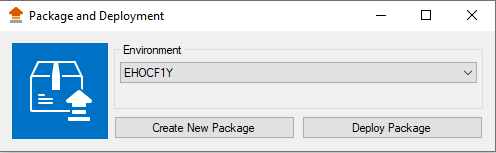
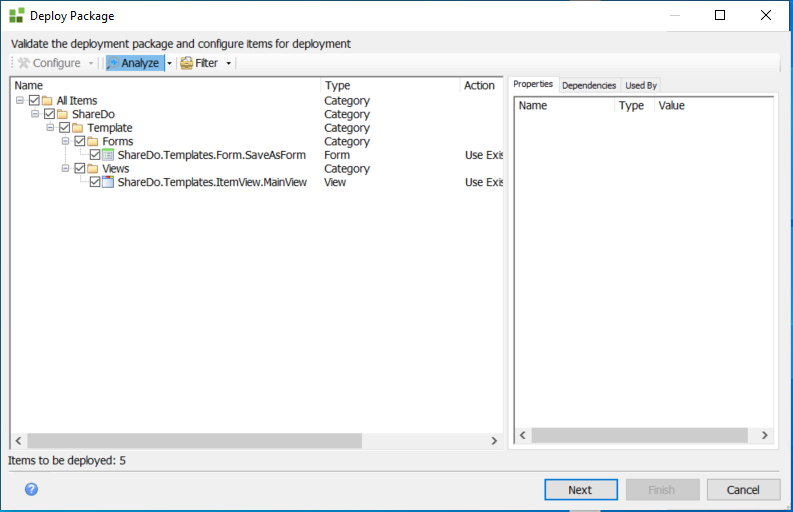
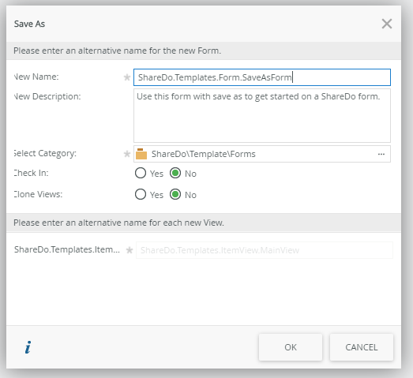
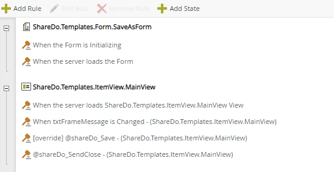
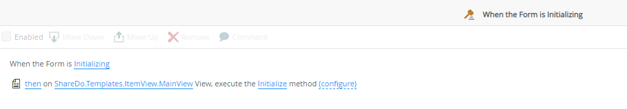
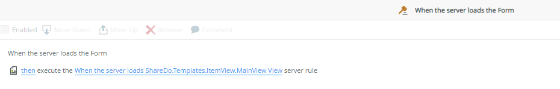
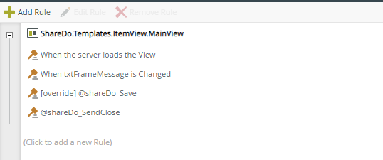
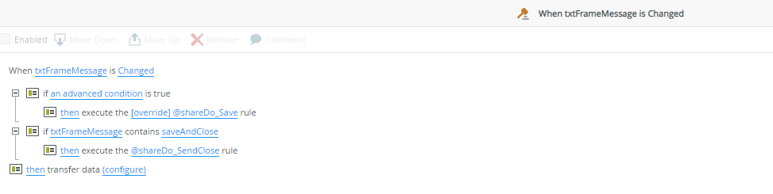
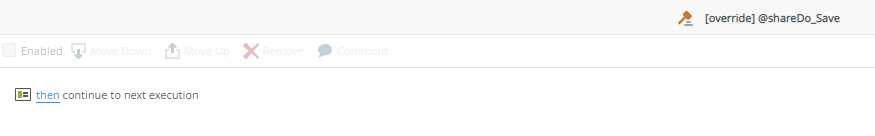
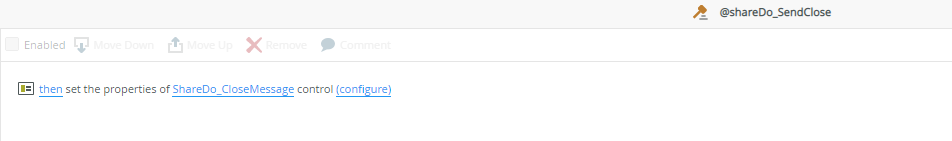

# K2 ShareDo Theme

The purpose of this document is to assist with adding the Sharedo theming into K2 smartforms.
For ease of use we've created a Sharedo package that includes the theming as well as the handling of Sharedo Blade Save and Close commands within the smarform.

## How to use the form

This form functions as a template and you should not to directly work with this form but to rather copy it into your own folder.

### Install the KSPX file

After you've downloaded the Sharedo Theme KSPX file, you need to use the Package and Deployement app to install it into your environment.

Select the _Deploy Package_ button. Browse to where you downloaded your file and select _Next_.

Select the _All Items_ checkbox, then select  the  _Analzyse_ button followed again by the _Next_ button.
 
### Copy the Form
After you've installed the Kspx package, go to the Sharedo folder, and open Templates. Select the ShareDo.Templates.Form.SaveAsForm form, select the Save As function to copy the form.

Select your category(folder) you would like to work from.
If the template view or form is checked out, you can select to Check them in here but please take note that you should not clone the views, this rule must always be set to No.
Click _OK_ and the form will now have been copied to your desired folder.

### Smartform Rules
This section is just a brief overview of the rules within the Sharedo Theme file.

#### ShareDo.Templates.Form.SaveAsForm Overview

The main form has two rules: 
1. When the Form is Initializing
2. When the server loads the Form

#### _1. When the Form is Initializing_

When the form is initialized, it executes the initialize method for the Sharedo.Templates.ItemView.MainView view

#### _2. When the server loads the Form_

This rule executes the server rule of the Sharedo.Templates.ItemView.MainView view which imports the CSSText control, providing the sharedo styling for the smartform and the scripting for the post message that is received from Sharedo.

### ShareDo.Templates.ItemView.MainView
The view contains four rules:
1. When the server loads the View
2. When txtFrameMessage is Changed
3. [override] @shareDo_Save
4. @shareDo_SendClose

#### _1. When the server loads the View_

It is important to remember that this rule should not be changed

#### _2. When txtFrameMessage is Changed_

This rule allows for the advanced conditions, and calls the @shareDo or @shareDo_SendClose depending on the condition set

#### _3. [override] @shareDo_Save_

With this rule, you can place your save mechanism in here to override the rule

#### _4. @shareDo_SendClose_

This rule closes the blade within Sharedo and it is a command you call yourself

## How to add custom theming to your form:

If you would like to add additional custom theming to the template, the first things you need to do is just ensure your environment is correct:

1. Ensure Node JS is installed and VS Code
2. You will need the Sharedo Theme file to adjust any theming and open the folder with VS Code
3. Open the command line in VS Code and run `npm start`
4. Follow the Apply process above as required.
      - i.e. If you just want to update the theme on a K2 SF Environment, just edit the theme View, save and check-in.
      - Follow entire Apply process when no theme view exists.
      
### To edit the theming to the existing view

1. Open **./release/Merged.html**
   _here you can edit the styling_
2. Copy the contents of the file
3. Edit the **ShareDo.Templates.ItemView.MainView** view
4. Add a DataLabel
5. :heavy_plus_sign: Add a server event rule `When the server loads the View`
6. Set the Control Properties of DataLabel using `Set a control's properties` and pressing `(configure)` :gear: 
   _if you are using the kspx file for your theming, copy it into the cssText property_
7. Paste the copied contents (copied from point 5) into the text value in the rule
8. **Check** the `Literal` property so that it applies **yes** (or true)
9. Save and check in the View.
      - At this point you are finished with this view and the "theme" can be added to all your SmartForms Forms for use.
      - **Repeat step 10 to end for each SF Form you want to apply the "theme" to.**
10. Include the view in a SmartForm Form to use.
      - You can add the views you want styled with the theme here or chose a Form that already has Views on it you want styled.  
      - **Note: This theme is designed to override the *Lithium Theme* on the Form and so not setting the theme to `Lithium` on the form may have undesired or expected results.**
  
## Additional Styling
### Labels
  - Append `ShareDoRegular` to each label you want displayed normally instead of the normal ShareDo Bold label.  
    `My label ShareDoRegular` or `My labelShareDoRegular` or  `label_ShareDoRegular` will all work.
